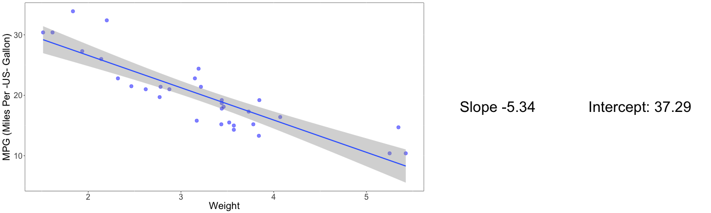

Fuel consumption Vs cars specificities
========================================================
author: GAEL BERON
date: 27/09/2017
autosize: true

Shiny Application: Fuel consumption Vs cars specificities
========================================================

This Shiny application aims to visualize what the fuel consumption is depending on each of a list of car specifities as per the data set 'mtcars'. Those data are from the US magazine Motor Trend which published its in 1974. It combines 11 aspects of automobile design and performance for a collection of 32 automobiles (1973–74 models).

The application invites the user to select one of the variable above in order to see what the fuel consumption is (in mpg), depending of the variability of it.

The application contains 4 tabs:

<ul style="font-size:28px">- Graphs: informations about mpg being the outcome of the selected variable</ul>
<ul style="font-size:28px">- Raw Data: gross data and their distribution on the 2 axes</ul>
<ul style="font-size:28px">- Help: documentation, content of the 'README.Rmd' file</ul>
<ul style="font-size:28px">- Credits: details about the dataset and credits</ul>

Shiny Application: Screenshot
========================================================

![] (./pictures/Screenshot_fuel_consumption_vs_cars_specificities.png)

[link to the Shiny App] (http://gaelberon.shinyapps.io/fuel_consumption_vs_cars_specificities)

Features
========================================================

The user is asked to select a car specificity, and the App is computing the linear regression of mpg being the outcome of the selected variable.

<ul style="font-size:28px">- 'MPG Vs X variable and linear regression': plots the mpg (y-axis) depending on the selected value (x-axis) and displays the linear regression `mpg ~ x`</ul>
<ul style="font-size:28px">- 'Slope' and 'Intercept': slope and intercept values of the linear regression `mpg ~ x` where x is the selected variable</ul>

Sums of Squares Graphs
========================================================
The App is drawing some nice graphs to visualize how the fuel consumption is variating depending on this variable.

Thanks for reading :)

